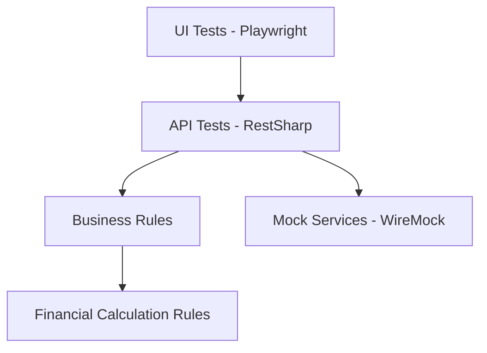
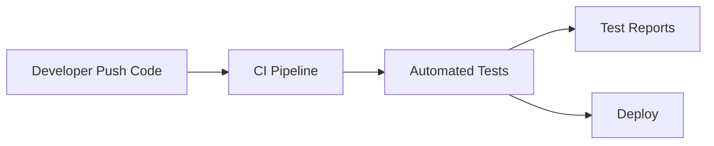
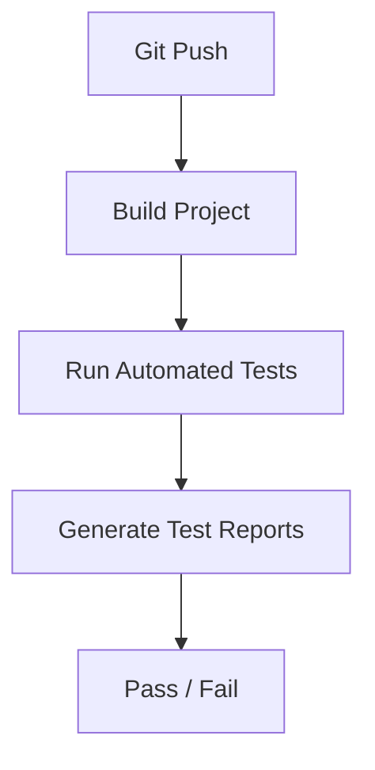

# BigTech Quality Engineering Automation Framework


Enterprise QA Automation Framework demonstrating modern **Quality Engineering practices used in fintech and big tech environments**.

This repository simulates how automation frameworks are structured in companies such as **Nubank, Mercado Livre, and large financial institutions**, focusing on scalable automation, observability, CI/CD integration and multi-layer testing.

---

# Tech Stack

- .NET 8
- NUnit
- Playwright
- RestSharp
- WireMock (Service Virtualization)
- PactNet (Contract Testing)
- k6 (Performance Testing)
- Docker (Test Environment)
- Grafana (Observability)
- GitHub Actions (CI/CD)
- Allure Reports

---

# Features

- API Automation
- UI Automation (Playwright)
- Screenshot & Video recording
- Service Virtualization
- Contract Testing
- Performance Testing
- CI/CD Ready
- Observability Metrics
- Parallel Test Execution
- Docker Test Environment

---

# Architecture

```
src
 ├── core
 ├── api
 ├── ui
 ├── fixtures
 ├── factories
 ├── contracts
 ├── observability
```

---

# Architecture Diagram



---

# Automation Execution Flow



---

# CI/CD Pipeline



---

# Visual Architecture Overview

Below is a **visual architecture diagram** that represents how the automation layers interact.


To enable this diagram in the repository:

1. Create a folder in the root of the project:

```
docs
```

2. Add the architecture image:

```
docs/automation-architecture.png
```

Once added, the image will automatically appear in this section of the README.

This is a common practice in **engineering documentation used by large technology companies**.

---

# UI Test Execution

When UI tests run the framework:

- Opens a real browser
- Executes test scenarios
- Captures screenshots
- Records video of execution

Example screenshot:


---

# How to Run the Project

These instructions allow any engineering team to download and run the framework locally.

## 1. Clone the Repository

```
git clone https://github.com/Gilvando21/bigtech-quality-engineering-automation-framework.git
cd bigtech-quality-engineering-automation-framework
```

---

## 2. Install Dependencies

Make sure the following tools are installed:

- .NET 8 SDK
- Node.js (required for Playwright)
- k6 (optional for performance tests)
- Docker (optional)

Restore project dependencies:

```
dotnet restore
```

---

## 3. Build the Project

```
dotnet build
```

---

## 4. Run Automated Tests

```
dotnet test
```

Expected output:

```
CT01_API_Test
CT02_API_Test
...
CT10_API_Test
```

UI tests will:

- open the browser
- execute scenarios
- generate screenshots
- record videos

---

# Performance Testing

Run performance tests with k6:

```
k6 run performance/k6_simulacao_test.js
```

---

# Docker Environment

To run the automation environment with Docker:

```
docker-compose up
```

This will start:

- Test runner
- Grafana dashboard

Grafana default access:

```
http://localhost:3000
```

---

# Observability

The framework includes observability integration compatible with:

- Grafana
- Prometheus
- Test execution metrics

Example configuration:

```
observability/grafana_dashboard.json
```

---

# Example Business Rule Tested

API endpoint:

```
POST /api/v1/simulacao/vgbl
```

Financial rule validated:

```
IOF = 5% applied to the value exceeding 600000
```

---

# Why This Project Exists

This project demonstrates how **Quality Engineering frameworks** can support:

- scalable automation
- service virtualization
- contract testing
- performance validation
- CI/CD pipelines
- observability for test systems

These practices are common in **modern fintech and big tech engineering teams**.

---

# Engineering Documentation

This repository includes engineering-style documentation similar to internal documentation used by large technology companies:

- Architecture diagrams
- Automation execution flow
- CI/CD pipeline visualization
- Framework design structure

---

# Author

**Gilvando Matos**  
Senior QA Engineer | QA Lead | Quality Engineering Specialist

Expertise:

- Test Automation Architecture
- API and UI Automation
- CI/CD Integration
- Observability for Test Systems
- Quality Engineering Strategy

LinkedIn  
https://www.linkedin.com/in/gilvando-matos-3a259821/

GitHub  
https://github.com/Gilvando21
