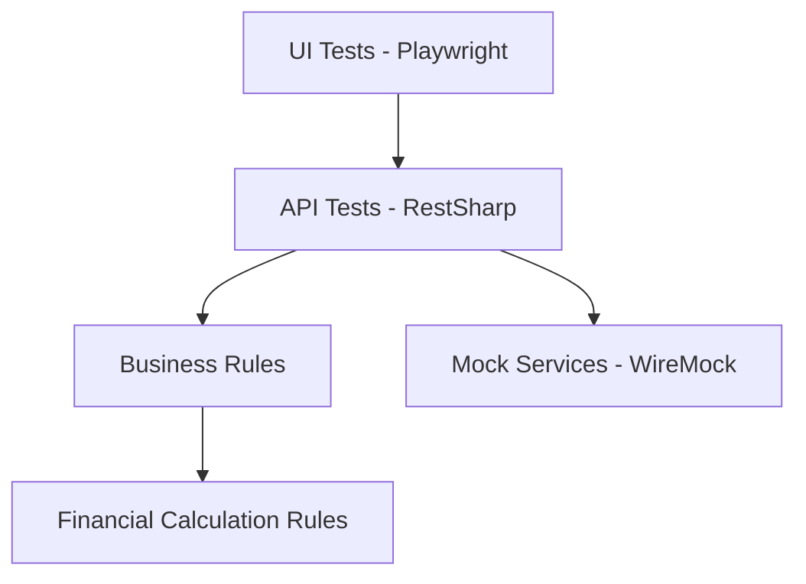
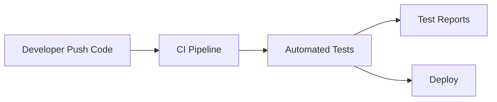
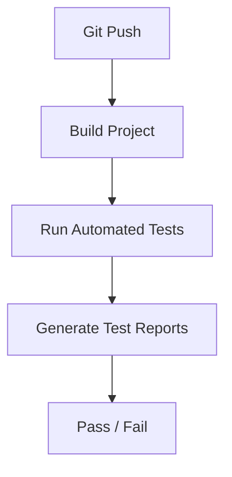

# BigTech Quality Engineering Automation Framework

Enterprise Quality Engineering Automation Framework designed to demonstrate scalable testing architecture used in fintech and high-scale technology environments.


This repository demonstrates how modern **Quality Engineering frameworks** can be structured using practices commonly found in fintech and large-scale technology companies.

---

# Tech Stack

- .NET 8
- NUnit
- Playwright
- RestSharp
- WireMock (Service Virtualization)
- PactNet (Contract Testing)
- k6 (Performance Testing)
- Docker (Test Environment)
- Grafana (Observability)
- GitHub Actions (CI/CD)
- Allure Reports

---

# Key Features

- API Automation
- UI Automation (Playwright)
- Screenshot & Video recording
- Service Virtualization
- Contract Testing
- Performance Testing
- CI/CD Ready
- Observability Metrics
- Parallel Test Execution
- Docker Test Environment

---

# Project Architecture

```
src
 ├── core
 ├── api
 ├── ui
 ├── fixtures
 ├── factories
 ├── contracts
 ├── observability
```

This architecture separates infrastructure, automation layers and observability components to support scalable automation frameworks.

---

# Architecture Diagram



---

# Automation Execution Flow



---

# CI/CD Pipeline



---

# Visual Architecture Diagram


To enable this diagram:

Create folder:

docs

Add image:

docs/automation-architecture.png

---

# UI Test Execution

When UI tests run the framework:

- Opens a real browser
- Executes test scenarios
- Captures screenshots
- Records execution video

Example screenshot:


---

# How to Run the Project

## 1 Clone repository

```bash
git clone https://github.com/Gilvando21/bigtech-quality-engineering-automation-framework.git
cd bigtech-quality-engineering-automation-framework
```

## 2 Install dependencies

Ensure installed:

- .NET 8 SDK
- Node.js
- Docker (optional)
- k6 (optional)

Restore dependencies:

```bash
dotnet restore
```

## 3 Build project

```bash
dotnet build
```

## 4 Run automated tests

```bash
dotnet test
```

Example output:

```
CT01_API_Test
CT02_API_Test
...
CT10_API_Test
```

# Performance Testing

```bash
k6 run performance/k6_simulacao_test.js
```

# Docker Test Environment

```bash
docker-compose up
```

Access Grafana:

http://localhost:3000

---

# Observability

Compatible with:

- Grafana
- Prometheus
- Test metrics

Example:

observability/grafana_dashboard.json

---

# Example Business Rule Tested

POST /api/v1/simulacao/vgbl

IOF = 5% applied to the value exceeding 600000

---

# Test Reports (Allure)

The framework generates test reports using **Allure**.

To generate the report locally:

```bash
dotnet test
allure serve allure-results
```

The report dashboard provides:

- Test execution overview
- Suites and behaviors
- Execution timeline
- Categories
- Environment information

Environment metadata is defined in:

allure-results/environment.properties

---

# Author

Gilvando Matos

Senior QA Engineer | QA Lead | Quality Engineering Specialist

LinkedIn: https://www.linkedin.com/in/gilvando-matos-3a259821/

GitHub
https://github.com/Gilvando21
