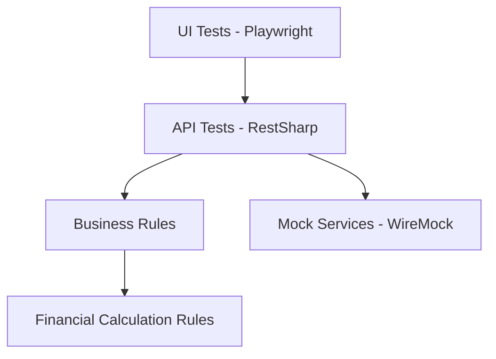
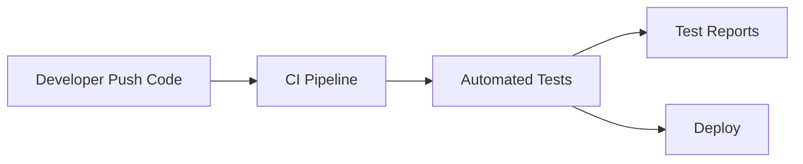
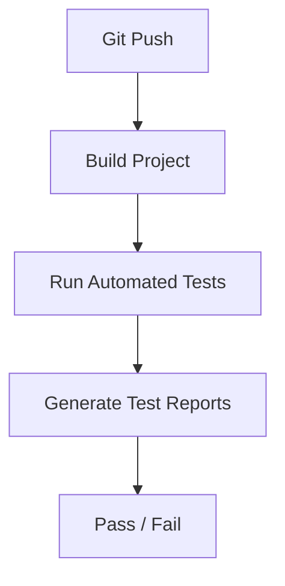

# BigTech Quality Engineering Automation Framework

Enterprise Quality Engineering Automation Framework designed to demonstrate scalable testing architecture used in fintech and high‑scale technology environments.


This repository demonstrates how **modern Quality Engineering frameworks** can be structured using practices commonly found in fintech and large‑scale technology companies such as Nubank, Mercado Livre and other high‑availability platforms.

---

# Tech Stack

- .NET 8
- NUnit
- Playwright
- RestSharp
- WireMock (Service Virtualization)
- PactNet (Contract Testing)
- k6 (Performance Testing)
- Docker (Test Environment)
- Grafana (Observability)
- GitHub Actions (CI/CD)
- Allure Reports

---

# Key Features

- API Automation
- UI Automation (Playwright)
- Screenshot & Video recording
- Service Virtualization
- Contract Testing
- Performance Testing
- CI/CD Ready
- Observability Metrics
- Parallel Test Execution
- Docker Test Environment

---

# Project Architecture

```
src
 ├── core
 ├── api
 ├── ui
 ├── fixtures
 ├── factories
 ├── contracts
 ├── observability
```

This architecture separates infrastructure, automation layers and observability components to support **scalable test automation systems**.

---

# Architecture Diagram



---

# Automation Execution Flow



---

# CI/CD Pipeline



---

# Visual Architecture Diagram

The README supports a visual architecture diagram.


To enable this diagram:

Create a folder in the project root:

```
docs
```

Add the architecture image:

```
docs/automation-architecture.png
```

This is a common documentation pattern used in **engineering teams to visualize system architecture**.

---

# UI Test Execution

When UI tests run the framework:

- Opens a real browser
- Executes test scenarios
- Captures screenshots
- Records video of execution

Example screenshot:


---

# How To Run The Project

These instructions allow engineering teams to quickly download and execute the framework locally.

## 1. Clone the repository

```
git clone https://github.com/Gilvando21/bigtech-quality-engineering-automation-framework.git
cd bigtech-quality-engineering-automation-framework
```

---

## 2. Install dependencies

Make sure the following tools are installed:

- .NET 8 SDK
- Node.js (required for Playwright)
- Docker (optional)
- k6 (optional for performance testing)

Restore dependencies:

```
dotnet restore
```

---

## 3. Build the project

```
dotnet build
```

---

## 4. Execute automated tests

```
dotnet test
```

Expected output:

```
CT01_API_Test
CT02_API_Test
...
CT10_API_Test
```

UI tests will:

- open the browser
- execute scenarios
- generate screenshots
- record videos

---

# Performance Testing

Run performance tests using k6:

```
k6 run performance/k6_simulacao_test.js
```

---

# Docker Test Environment

Run the full automation environment using Docker:

```
docker-compose up
```

This will start:

- Test runner
- Grafana dashboard

Grafana access:

```
http://localhost:3000
```

---

# Observability

The framework includes observability support compatible with:

- Grafana
- Prometheus
- Test execution metrics

Configuration example:

```
observability/grafana_dashboard.json
```

---

# Example Business Rule Tested

API endpoint:

```
POST /api/v1/simulacao/vgbl
```

Business rule validated:

```
IOF = 5% applied to the value exceeding 600000
```

---

# Purpose of This Project

This repository demonstrates how **Quality Engineering frameworks** can support:

- scalable automation
- service virtualization
- contract testing
- performance validation
- CI/CD pipelines
- observability for automated tests

These practices are widely used in **modern fintech and high‑scale technology engineering teams**.

---

# Author

**Gilvando Matos**  
Senior QA Engineer | QA Lead | Quality Engineering Specialist

Specialties:

- Test Automation Architecture
- API & UI Automation
- CI/CD Integration
- Observability for Testing Platforms
- Quality Engineering Strategy

LinkedIn  
https://www.linkedin.com/in/gilvando-matos-3a259821/

GitHub  
https://github.com/Gilvando21
